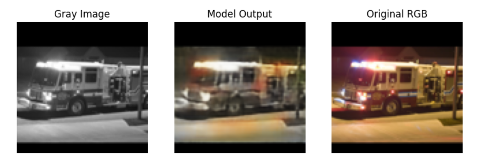
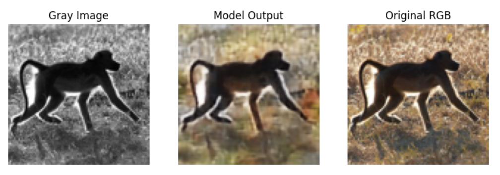
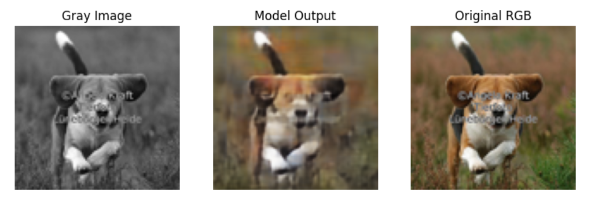

# image-colorization
A deep learning–based project developed for the MEISSA Project (LIAD/UFCG) that performs colorization of black-and-white images using PyTorch.

**DESCRIPTION**

This project uses deep learning to colorize grayscale images automatically, using tools like PyTorch and Torchvision. The project is based on a convolutional autoencoder neural network, which learns how to transform black-and-white images into colored ones. During training, the model picks up decisive and remarkable patterns like edges, textures, and general image context, helping it generate more realistic results. It was developed as part of a MEISSA Project (LIAD/UFCG) training, focusing on image colorization tasks.

Below are some comparisons between the model’s results and the real colored images.

**HOW TO RUN**

1. Click on "Open In Colab"
2. Run all cells
3. Re-run the last to see more results

**AUTHOR**

Anne Grazieli Marques Silva, Computer Science student at UFCG
